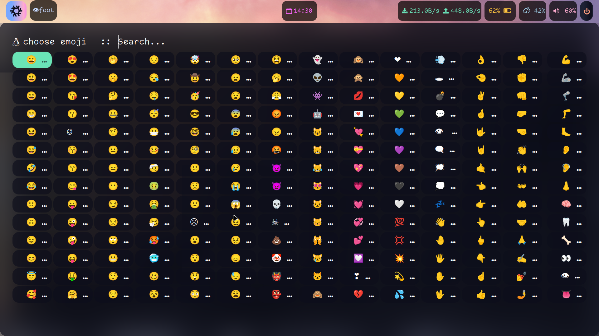

#   Shell Scripts

These are some cool scripts which basically is a menu of options, which are handy for window manager users.

Its is fast and also snappy.

All menu commands can be defined in [d-var.conf](bin/d-var.conf)

**Most of the scripts are based on Wayland (as it is the Future of Linux)**
Although you can adjust it for x11 too.

Old-scripts directory is x11 based.

> **Why are all the scripts prefixed 'd-'**
>  ==>  It is easier to identify and call them, also An OnePiece fan will know a reason.

#   Gist of Scripts

d-unicodes

## Emoji/Icon picker using rofi (any launcher)
  *  Easy to use, works offline, use it anywhere.
  *  Keywords have similar words, searching is right at your finger tip.

